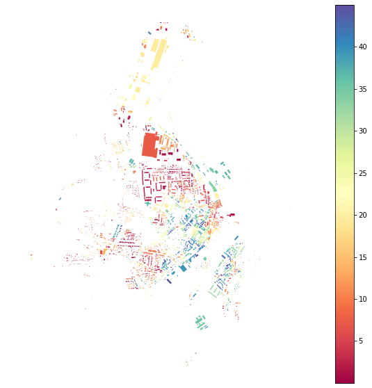
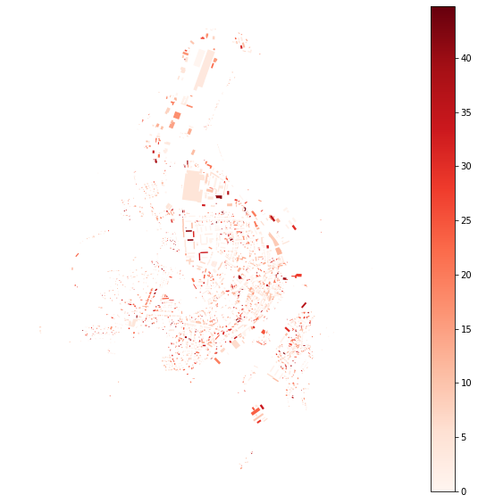
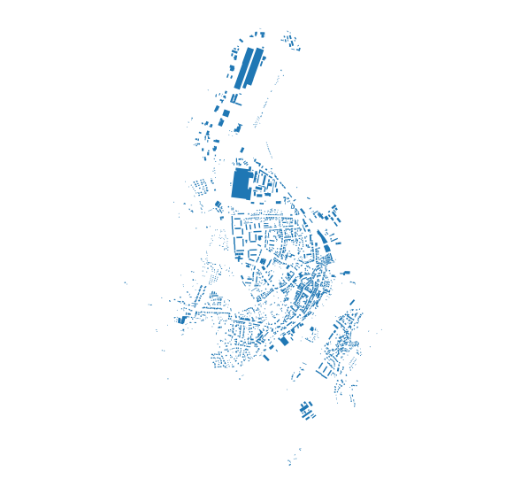
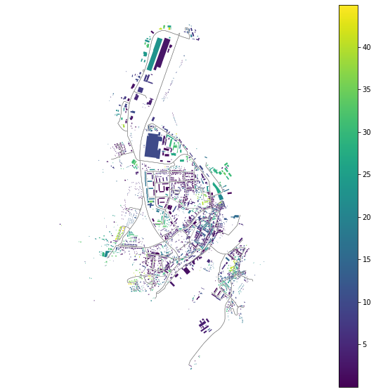
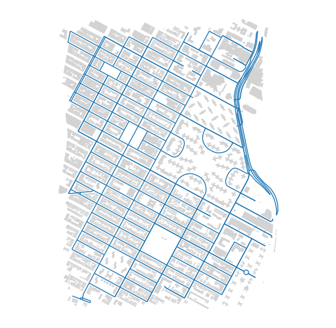
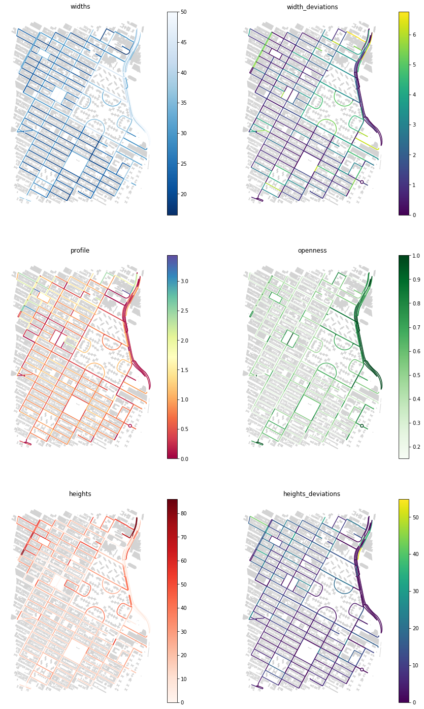

# Measuring spatial distribution

Spatial distribution can be captured many ways. This notebook show couple of them, based on orientation and street corridor.


<div markdown="1" class="cell code_cell">
<div class="input_area" markdown="1">
```python
import momepy
import geopandas as gpd
import matplotlib.pyplot as plt

```
</div>

</div>


<div markdown="1" class="cell code_cell">
<div class="input_area" markdown="1">
```python
import osmnx as ox

gdf = ox.footprints.footprints_from_place(place='Kahla, Germany')
gdf_projected = ox.project_gdf(gdf)

buildings = momepy.preprocess(gdf_projected, size=30,
                              compactness=True, islands=True)
buildings['uID'] = momepy.unique_id(buildings)
limit = momepy.buffered_limit(buildings)
tessellation = momepy.Tessellation(buildings, unique_id='uID', limit=limit).tessellation

```
</div>

<div class="output_wrapper" markdown="1">
<div class="output_subarea" markdown="1">
{:.output_stream}
```
Loop 1 out of 2.
Loop 2 out of 2.
Inward offset...
Discretization...
Generating input point array...
Generating Voronoi diagram...
Generating GeoDataFrame...
Dissolving Voronoi polygons...
Preparing limit for edge resolving...
Building R-tree...
Identifying edge cells...
Cutting...
```
</div>
</div>
</div>


<div markdown="1" class="cell code_cell">
<div class="input_area" markdown="1">
```python
streets_graph = ox.graph_from_place('Kahla, Germany', network_type='drive')
streets_graph = ox.project_graph(streets_graph)
edges = ox.save_load.graph_to_gdfs(streets_graph, nodes=False, edges=True,
                                   node_geometry=False, fill_edge_geometry=True)

```
</div>

</div>


## Alignment

We can measure alignment of different elements to their neighbours (for which `spatial_weights` are needed) or to different elements. We will explore cell alignment (difference of orientation of buildings and cells) and street alignment (difference of orientation of buildings and street segments).

### Cell alignment

For `CellAlignment` we need to know orientations, so let's calculate them first. Orientation is defined as an orientation of the longext axis of bounding rectangle in range [0,45). It captures the deviation of orientation from cardinal directions:


<div markdown="1" class="cell code_cell">
<div class="input_area" markdown="1">
```python
buildings['orientation'] = momepy.Orientation(buildings).o
tessellation['orientation'] = momepy.Orientation(tessellation).o

```
</div>

</div>


<div markdown="1" class="cell code_cell">
<div class="input_area hidecode" markdown="1">
```python
f, ax = plt.subplots(figsize=(10, 10))
buildings.plot(ax=ax, column='orientation', legend=True, cmap='Spectral')
ax.set_axis_off()
plt.axis('equal')
plt.show()

```
</div>

<div class="output_wrapper" markdown="1">
<div class="output_subarea" markdown="1">

{:.output_png}


</div>
</div>
</div>


`CellAlignment` requires both gdfs, orientation values for left and right gdf and unique ID linking both gdfs as is in left and right gdf:


<div markdown="1" class="cell code_cell">
<div class="input_area" markdown="1">
```python
blg_cell_align = momepy.CellAlignment(buildings, tessellation,
                                      'orientation', 'orientation',
                                      'uID', 'uID')
buildings['cell_align'] = blg_cell_align.ca

```
</div>

</div>


<div markdown="1" class="cell code_cell">
<div class="input_area hidecode" markdown="1">
```python
f, ax = plt.subplots(figsize=(10, 10))
buildings.plot(ax=ax, column='cell_align', legend=True, cmap='Reds')
ax.set_axis_off()
plt.axis('equal')
plt.show()

```
</div>

<div class="output_wrapper" markdown="1">
<div class="output_subarea" markdown="1">

{:.output_png}


</div>
</div>
</div>


No really clear pattern is visible in this case, but it might be in other, especially comparing building orientation with plots.

### Street alignment

Street alignment works on the same principle as cell alignment. What we do not have at this moment is network ID, so we have to generate it and link it to buildings:


<div markdown="1" class="cell code_cell">
<div class="input_area" markdown="1">
```python
edges['networkID'] = momepy.unique_id(edges)
buildings['networkID'] = momepy.get_network_id(buildings, edges,
                                               'networkID')

```
</div>

<div class="output_wrapper" markdown="1">
<div class="output_subarea" markdown="1">
{:.output_stream}
```
Generating centroids...
Generating rtree...
```
</div>
</div>
</div>


OSM network is not ideal in our case, it is missing in part of the study area. Some objects were not attached to the network with `min_size` defaulting to 100 metres. We can either use larger distance or drop unlinked buildings. 


<div markdown="1" class="cell code_cell">
<div class="input_area" markdown="1">
```python
buildings_net = buildings.loc[buildings.networkID >= 0]

```
</div>

</div>


<div markdown="1" class="cell code_cell">
<div class="input_area hidecode" markdown="1">
```python
f, ax = plt.subplots(figsize=(10, 10))
buildings_net.plot(ax=ax)
ax.set_axis_off()
plt.axis('equal')
plt.show()

```
</div>

<div class="output_wrapper" markdown="1">
<div class="output_subarea" markdown="1">

{:.output_png}


</div>
</div>
</div>


`StreetAlignment` will take care of street orientation (saved under `orientations` attribute):


<div markdown="1" class="cell code_cell">
<div class="input_area" markdown="1">
```python
str_align = momepy.StreetAlignment(buildings_net, edges,
                                   'orientation', 'networkID',
                                   'networkID')
buildings_net['str_align'] = str_align.sa

```
</div>

</div>


<div markdown="1" class="cell code_cell">
<div class="input_area hidecode" markdown="1">
```python
f, ax = plt.subplots(figsize=(10, 10))
edges.plot(ax=ax, color='grey', linewidth=0.5)
buildings_net.plot(ax=ax, column='str_align', legend=True)
ax.set_axis_off()
plt.axis('equal')
plt.show()

```
</div>

<div class="output_wrapper" markdown="1">
<div class="output_subarea" markdown="1">

{:.output_png}


</div>
</div>
</div>


## Street profile

`StreetProfile` captures several characters at the same time. It generates a series of perpendicular ticks of set length and set spacing and returns mean widths of street profile, their standard deviation, mean height and its standard deviation, profile as a ratio of widht and height and degree of openness. If heights are not passed, it will not return them and profile. We will use Manhattan example to illustrate how it works. Building `height` column is converted to float and buildings are exploded to avoid multipolygons.


<div markdown="1" class="cell code_cell">
<div class="input_area" markdown="1">
```python
point = (40.731603, -73.977857)
dist = 1000
gdf = ox.footprints.footprints_from_point(point, distance=dist)
buildings = ox.project_gdf(gdf)
buildings['height'] = buildings['height'].fillna(0).astype(float)
buildings = buildings.explode()
buildings.reset_index(inplace=True, drop=True)

```
</div>

</div>


<div markdown="1" class="cell code_cell">
<div class="input_area" markdown="1">
```python
streets_graph = ox.graph_from_point(point, distance=dist, network_type='drive')
streets_graph = ox.project_graph(streets_graph)
edges = ox.save_load.graph_to_gdfs(streets_graph, nodes=False, edges=True,
                                   node_geometry=False, fill_edge_geometry=True)

```
</div>

</div>


<div markdown="1" class="cell code_cell">
<div class="input_area hidecode" markdown="1">
```python
f, ax = plt.subplots(figsize=(10, 10))
buildings.plot(ax=ax, color='lightgrey')
edges.plot(ax=ax)
ax.set_axis_off()
plt.axis('equal')
plt.show()

```
</div>

<div class="output_wrapper" markdown="1">
<div class="output_subarea" markdown="1">

{:.output_png}


</div>
</div>
</div>


<div markdown="1" class="cell code_cell">
<div class="input_area" markdown="1">
```python
profile = momepy.StreetProfile(edges, buildings, heights='height')

```
</div>

</div>


We can assign measrued characters as columns of edges gdf:


<div markdown="1" class="cell code_cell">
<div class="input_area" markdown="1">
```python
edges['widths'] = profile.w
edges['width_deviations'] = profile.wd
edges['openness'] = profile.o
edges['heights'] = profile.h
edges['heights_deviations'] = profile.hd
edges['profile'] = profile.p

```
</div>

</div>


<div markdown="1" class="cell code_cell">
<div class="input_area hidecode" markdown="1">
```python
f, axes = plt.subplots(figsize=(15, 25), ncols=2, nrows=3)
edges.plot(ax=axes[0][0], column='widths', legend=True, cmap='Blues_r')
buildings.plot(ax=axes[0][0], color='lightgrey')
edges.plot(ax=axes[0][1], column='width_deviations', legend=True)
buildings.plot(ax=axes[0][1], color='lightgrey')
axes[0][0].set_axis_off()
axes[0][0].set_title('widths')
axes[0][1].set_axis_off()
axes[0][1].set_title('width_deviations')
edges.plot(ax=axes[1][0], column='profile', legend=True, cmap='Spectral')
buildings.plot(ax=axes[1][0], color='lightgrey')
edges.plot(ax=axes[1][1], column='openness', legend=True, cmap='Greens')
buildings.plot(ax=axes[1][1], color='lightgrey')
axes[1][0].set_axis_off()
axes[1][0].set_title('profile')
axes[1][1].set_axis_off()
axes[1][1].set_title('openness')
edges.plot(ax=axes[2][0], column='heights', legend=True, cmap='Reds')
buildings.plot(ax=axes[2][0], color='lightgrey')
edges.plot(ax=axes[2][1], column='heights_deviations', legend=True)
buildings.plot(ax=axes[2][1], color='lightgrey')
axes[2][0].set_axis_off()
axes[2][0].set_title('heights')
axes[2][1].set_axis_off()
axes[2][1].set_title('heights_deviations')
plt.show()

```
</div>

<div class="output_wrapper" markdown="1">
<div class="output_subarea" markdown="1">

{:.output_png}


</div>
</div>
</div>

