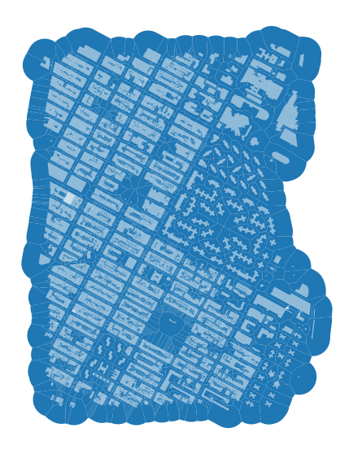
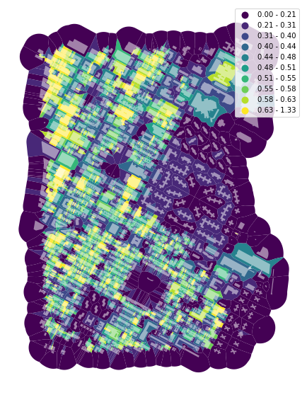
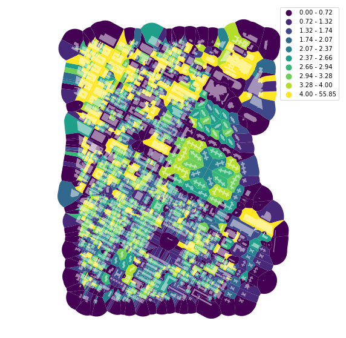

# Measuring density

Measuring density is a typical exercise in urban analytics. `momepy` allows to measure different types (see [API/Intensity](https://docs.momepy.org/en/latest/api.html#intensity)); this notebook will outline the main principles.


<div markdown="1" class="cell code_cell">
<div class="input_area" markdown="1">
```python
import momepy
import geopandas as gpd
import matplotlib.pyplot as plt

```
</div>

</div>


We will again use `osmnx` to get the data for our example and after preprocessing of building layer will generate tessellation.


<div markdown="1" class="cell code_cell">
<div class="input_area" markdown="1">
```python
import osmnx as ox

point = (40.731603, -73.977857)
dist = 1000
gdf = ox.footprints.footprints_from_point(point=point, distance=dist)
gdf_projected = ox.project_gdf(gdf)

buildings = momepy.preprocess(gdf_projected, size=30,
                              compactness=True, islands=True)
buildings['uID'] = momepy.unique_id(buildings)
limit = momepy.buffered_limit(buildings)
tessellation = momepy.Tessellation(buildings, unique_id='uID', limit=limit).tessellation

```
</div>

<div class="output_wrapper" markdown="1">
<div class="output_subarea" markdown="1">
{:.output_stream}
```
Loop 1 out of 2.
Loop 2 out of 2.
Inward offset...
Discretization...
Generating input point array...
Generating Voronoi diagram...
Generating GeoDataFrame...
Dissolving Voronoi polygons...
Preparing limit for edge resolving...
Building R-tree...
Identifying edge cells...
Cutting...
```
</div>
</div>
</div>


<div markdown="1" class="cell code_cell">
<div class="input_area hidecode" markdown="1">
```python
f, ax = plt.subplots(figsize=(10, 10))
tessellation.plot(ax=ax)
buildings.plot(ax=ax, color='white', alpha=.5)
ax.set_axis_off()
plt.axis('equal')
plt.show()

```
</div>

<div class="output_wrapper" markdown="1">
<div class="output_subarea" markdown="1">

{:.output_png}


</div>
</div>
</div>


We have some edge effect here as we are using the buffer as a limit for tessellation in the middle of the urban fabric, but for these examples, we can work with it anyway. Keep in mind that values on the edge of this area will be skewed.

## Covered Area Ratio

Covered area ratio, in our case measured on tessellation cells, requires `GeoDataFrame` containing spatial unit (cell, plot), and `GeoDataFrame` containing covering objects (buildings). On top of that, it currently requires passed areas for both gdfs and unique ID which links together spatial units and objects on them. We can either calculate areas before:


<div markdown="1" class="cell code_cell">
<div class="input_area" markdown="1">
```python
tessellation['area'] = momepy.Area(tessellation).area
buildings['area'] = momepy.Area(buildings).area
tess_car = momepy.AreaRatio(tessellation, buildings, 'area', 'area', 'uID')
tessellation['CAR'] = tess_car.ar

```
</div>

</div>


Or we can pass `momepy.Area().area` directly:


<div markdown="1" class="cell code_cell">
<div class="input_area" markdown="1">
```python
tess_car = momepy.AreaRatio(tessellation, buildings,
                            momepy.Area(tessellation).area,
                            momepy.Area(buildings).area, 'uID')
tessellation['CAR'] = tess_car.ar

```
</div>

</div>


<div markdown="1" class="cell code_cell">
<div class="input_area hidecode" markdown="1">
```python
f, ax = plt.subplots(figsize=(10, 10))
tessellation.plot(ax=ax, column='CAR', legend=True, scheme='quantiles', k=10, cmap='viridis')
buildings.plot(ax=ax, color='white', alpha=0.5)
ax.set_axis_off()
plt.axis('equal')
plt.show()

```
</div>

<div class="output_wrapper" markdown="1">
<div class="output_subarea" markdown="1">

{:.output_png}


</div>
</div>
</div>


Note: At the time of preparing this notebook, there was a duplicated building within the used area, causing the value 1.33.
## Floor Area Ratio

Because we know building heights for our `buildings` gdf, we can also calculate FAR. This part of New York has height data, only stored as strings, so we have to convert them to `floats` (or `int`) and fill `NaN` values with zero.

FAR requires floor areas for building gdf instead of covered area.


<div markdown="1" class="cell code_cell">
<div class="input_area" markdown="1">
```python
buildings['height'] = buildings['height'].fillna(0).astype(float)

buildings['floor_area'] = momepy.FloorArea(buildings, 'height').fa

```
</div>

</div>


<div markdown="1" class="cell code_cell">
<div class="input_area" markdown="1">
```python
tessellation['FAR'] = momepy.AreaRatio(tessellation, buildings,
                                       'area', 'floor_area', 'uID').ar

```
</div>

</div>


<div markdown="1" class="cell code_cell">
<div class="input_area hidecode" markdown="1">
```python
f, ax = plt.subplots(figsize=(10, 10))
tessellation.plot(ax=ax, column='FAR', legend=True, scheme='quantiles', k=10, cmap='viridis')
buildings.plot(ax=ax, color='white', alpha=0.5)
ax.set_axis_off()
plt.axis('equal')
plt.show()

```
</div>

<div class="output_wrapper" markdown="1">
<div class="output_subarea" markdown="1">

{:.output_png}


</div>
</div>
</div>


Location-based density is described in [examples using spatial weights](weights/examples).

