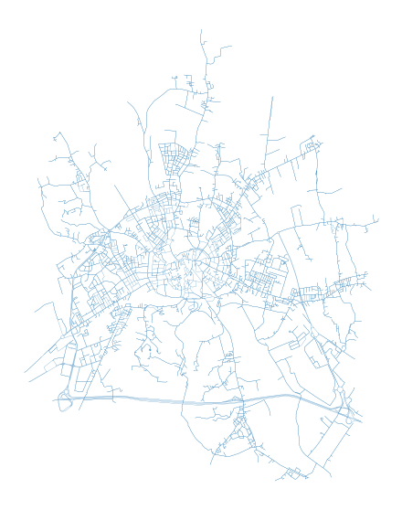
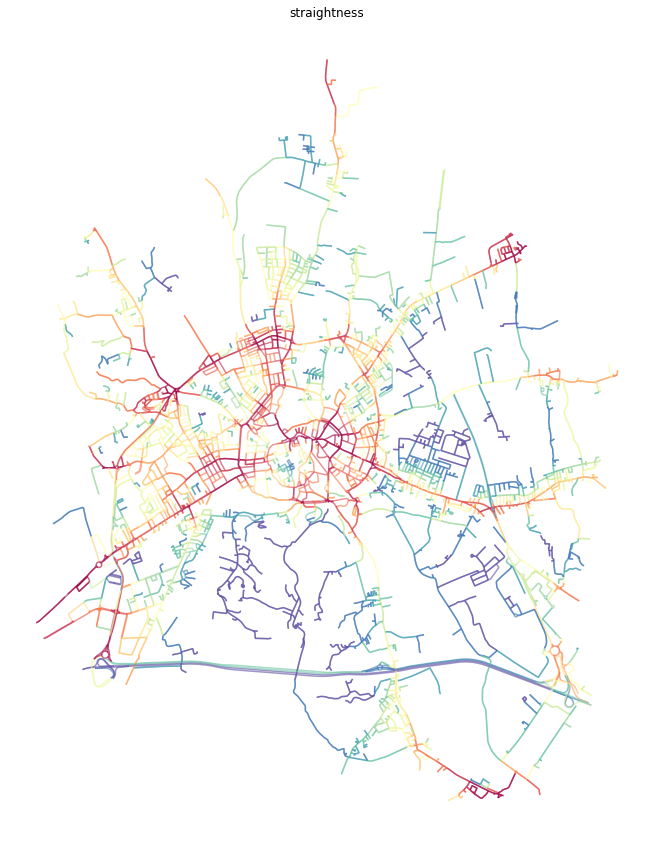
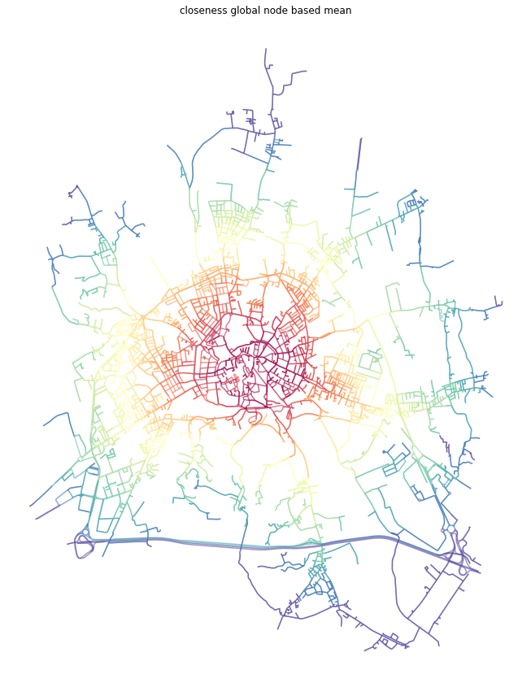

# Multiple Centrality Assessment

Multiple Centrality Assessment (MCA) is an approach to street network analysis developed by Porta and Latora (2006). It's main aim is to understand the structure of street network of our cities from the perspective of the importance and position of each street/intersection within the whole network as expressed by various centralities. Momepy can do all types of MCA-based centrality analysis as were developed through the years.

The aim of this notebook is to illustrate how to measure different centralities using momepy. For the theoretical background, please refer to the work of Porta et al.


<div markdown="1" class="cell code_cell">
<div class="input_area" markdown="1">
```python
import geopandas as gpd
import momepy
import osmnx as ox
import matplotlib.pyplot as plt

```
</div>

</div>


In the ideal case, momepy expects LineString GeoDataFrame containing street network as a starting point. Either we have our own, or we can use osmnx to dowload network from OSM. In this notebook, we will look at Vicenza, Italy.


<div markdown="1" class="cell code_cell">
<div class="input_area" markdown="1">
```python
streets_graph = ox.graph_from_place('Vicenza, Italy', network_type='drive')
streets_graph = ox.project_graph(streets_graph)

```
</div>

</div>


Code above dowloaded network from OSM and projected it. At this point, `streets_graph` is networkX Graph object, similar to the one we will use in momepy. In theory, you can use it directly. However, momepy when converting GeoDataFrame to network ensures that all attributes are set and compatible with morphometric functions, so we do recommend saving graph to gdf and let momepy do the conversion back to graph.


<div markdown="1" class="cell code_cell">
<div class="input_area" markdown="1">
```python
edges = ox.save_load.graph_to_gdfs(streets_graph, nodes=False, edges=True,
                                   node_geometry=False, fill_edge_geometry=True)

```
</div>

</div>


<div markdown="1" class="cell code_cell">
<div class="input_area hidecode" markdown="1">
```python
f, ax = plt.subplots(figsize=(10, 10))
edges.plot(ax=ax, linewidth=0.2)
ax.set_axis_off()
plt.axis('equal')
plt.show()

```
</div>

<div class="output_wrapper" markdown="1">
<div class="output_subarea" markdown="1">

{:.output_png}


</div>
</div>
</div>


To measure centrality, we have to *convert* gdf to graph. For that, we can choose from two options how to represent street network within graph. First and the most straightforward one is the primal approach (Porta et al., 2006) where street is represented by graph edge and intersection by node.

## Primal graph

We can generate networkX.MultiGraph, which is used within momepy, using `gdf_to_nx`.


<div markdown="1" class="cell code_cell">
<div class="input_area" markdown="1">
```python
primal = momepy.gdf_to_nx(edges, approach='primal')

```
</div>

</div>


### Closeness centrality

Closeness centrality could be simplified as average distance to every other node from each node. As such, it can be measured on the whole network (Global Closeness Centrality) or wihtin certain reach only (Local Closeness Centrality). 

#### Local closeness
To measure `local_closeness_centrality` we need to specify radius (how far we should go from each node). We can use topological distance (e.g. 5 steps, then radius=5) or metric distance (e.g. 400 metres) - then radius=400 and distance= lenght of each segment saved as a parameter of each edge. By default, momepy saves length as `mm_len`. 

Weight parameter is used for centrality calculation. Again, we can use metric weight (using the same attribute as above) or no weight (weight=None) at all. Or any other attribute we wish.


<div markdown="1" class="cell code_cell">
<div class="input_area" markdown="1">
```python
primal = momepy.local_closeness_centrality(primal, radius=400, name='closeness400', distance='mm_len', weight='mm_len')

```
</div>

</div>


<div markdown="1" class="cell code_cell">
<div class="input_area hidecode" markdown="1">
```python
nodes = momepy.nx_to_gdf(primal, lines=False)
f, ax = plt.subplots(figsize=(15, 15))
nodes.plot(ax=ax, column='closeness400', cmap='Spectral_r', scheme='quantiles', k=15, alpha=0.6)
ax.set_axis_off()
ax.set_title('closeness400')
plt.axis('equal')
plt.show()

```
</div>

<div class="output_wrapper" markdown="1">
<div class="output_subarea" markdown="1">

{:.output_png}


</div>
</div>
</div>


#### Global closeness

Global closeness centrality is a bit simpler as we do not have to specify radius and distance, the rest remains the same.


<div markdown="1" class="cell code_cell">
<div class="input_area" markdown="1">
```python
primal = momepy.closeness_centrality(primal, name='closeness_global', weight='mm_len')

```
</div>

</div>


<div markdown="1" class="cell code_cell">
<div class="input_area hidecode" markdown="1">
```python
nodes = momepy.nx_to_gdf(primal, lines=False)
f, ax = plt.subplots(figsize=(15, 15))
nodes.plot(ax=ax, column='closeness_global', cmap='Spectral_r', scheme='quantiles', k=15, alpha=0.6)
ax.set_axis_off()
ax.set_title('closeness_global')
plt.axis('equal')
plt.show()

```
</div>

<div class="output_wrapper" markdown="1">
<div class="output_subarea" markdown="1">

{:.output_png}


</div>
</div>
</div>


### Betweenness

Betweenness centrality measures the importance of each node or edge for the travelling along the network. It measures how many times is each node/edge used if we walk using the shortest paths from each node to every other. 

We have two options how to measure betweenness on primal graph - on nodes or on edges.

#### Node-based
Node-based betweenness, as name suggests, measures betweennes of each node - how many times we would walk through node.


<div markdown="1" class="cell code_cell">
<div class="input_area" markdown="1">
```python
primal = momepy.betweenness_centrality(primal, name='betweenness_metric_n', mode='nodes', weight='mm_len')

```
</div>

</div>


<div markdown="1" class="cell code_cell">
<div class="input_area hidecode" markdown="1">
```python
nodes = momepy.nx_to_gdf(primal, lines=False)
f, ax = plt.subplots(figsize=(15, 15))
nodes.plot(ax=ax, column='betweenness_metric_n', cmap='Spectral_r', scheme='quantiles', k=15, alpha=0.6)
ax.set_axis_off()
ax.set_title('betweenness_metric_n')
plt.axis('equal')
plt.show()

```
</div>

<div class="output_wrapper" markdown="1">
<div class="output_subarea" markdown="1">

{:.output_png}


</div>
</div>
</div>


#### Edge-based

Edge-based betweenness does the same but for edges. How many times we go through each edge (street).


<div markdown="1" class="cell code_cell">
<div class="input_area" markdown="1">
```python
primal = momepy.betweenness_centrality(primal, name='betweenness_metric_e', mode='edges', weight='mm_len')

```
</div>

</div>


<div markdown="1" class="cell code_cell">
<div class="input_area hidecode" markdown="1">
```python
primal_gdf = momepy.nx_to_gdf(primal, points=False)
f, ax = plt.subplots(figsize=(15, 15))
primal_gdf.plot(ax=ax, column='betweenness_metric_e', cmap='Spectral_r', scheme='quantiles', k=15, alpha=0.6)
ax.set_axis_off()
ax.set_title('betweennes edge based')
plt.axis('equal')
plt.show()

```
</div>

<div class="output_wrapper" markdown="1">
<div class="output_subarea" markdown="1">

{:.output_png}


</div>
</div>
</div>


### Straightness

While both closeness and betweenness are generally used in many applications of network analysis, straightness centrality is specific to street networks as it requires geographical element. It is measured as a ratio between real and Euclidean distance while waking from each node to every other.


<div markdown="1" class="cell code_cell">
<div class="input_area" markdown="1">
```python
primal = momepy.straightness_centrality(primal)

```
</div>

</div>


<div markdown="1" class="cell code_cell">
<div class="input_area hidecode" markdown="1">
```python
nodes = momepy.nx_to_gdf(primal, lines=False)
f, ax = plt.subplots(figsize=(15, 15))
nodes.plot(ax=ax, column='straightness', cmap='Spectral_r', scheme='quantiles', k=15, alpha=0.6)
ax.set_axis_off()
ax.set_title('straightness')
plt.axis('equal')
plt.show()

```
</div>

<div class="output_wrapper" markdown="1">
<div class="output_subarea" markdown="1">

{:.output_png}


</div>
</div>
</div>


### Node values averaged onto edges

In some cases, it is easier to understand centrality results if they are attached to street segments, rather than intersections. We can do an approximation using the mean value attached to start and end node of each edge.


<div markdown="1" class="cell code_cell">
<div class="input_area" markdown="1">
```python
momepy.mean_nodes(primal, 'straightness')
momepy.mean_nodes(primal, 'closeness400')
momepy.mean_nodes(primal, 'closeness_global')
momepy.mean_nodes(primal, 'betweenness_metric_n')

```
</div>

</div>


<div markdown="1" class="cell code_cell">
<div class="input_area hidecode" markdown="1">
```python
primal_gdf = momepy.nx_to_gdf(primal, points=False)

f, ax = plt.subplots(figsize=(15, 15))
primal_gdf.plot(ax=ax, column='straightness', cmap='Spectral_r', scheme='quantiles', k=15, alpha=0.6)
ax.set_axis_off()
ax.set_title('straightness')
plt.axis('equal')
plt.show()

```
</div>

<div class="output_wrapper" markdown="1">
<div class="output_subarea" markdown="1">

{:.output_png}


</div>
</div>
</div>


<div markdown="1" class="cell code_cell">
<div class="input_area hidecode" markdown="1">
```python
f, ax = plt.subplots(figsize=(15, 15))
primal_gdf.plot(ax=ax, column='closeness4', cmap='Spectral_r', scheme='quantiles', k=15, alpha=0.6)
ax.set_axis_off()
ax.set_title('closeness400 node based mean')
plt.axis('equal')
plt.show()

```
</div>

<div class="output_wrapper" markdown="1">
<div class="output_subarea" markdown="1">

{:.output_png}


</div>
</div>
</div>


<div markdown="1" class="cell code_cell">
<div class="input_area hidecode" markdown="1">
```python
f, ax = plt.subplots(figsize=(15, 15))
primal_gdf.plot(ax=ax, column='closeness_', cmap='Spectral_r', scheme='quantiles', k=15, alpha=0.6)
ax.set_axis_off()
ax.set_title('closeness global node based mean')
plt.axis('equal')
plt.show()

```
</div>

<div class="output_wrapper" markdown="1">
<div class="output_subarea" markdown="1">

{:.output_png}


</div>
</div>
</div>


<div markdown="1" class="cell code_cell">
<div class="input_area hidecode" markdown="1">
```python
f, ax = plt.subplots(figsize=(15, 15))
primal_gdf.plot(ax=ax, column='betweenness_metric_n', cmap='Spectral_r', scheme='quantiles', k=15, alpha=0.6)
ax.set_axis_off()
ax.set_title('betweennes node based mean')
plt.axis('equal')
plt.show()

```
</div>

<div class="output_wrapper" markdown="1">
<div class="output_subarea" markdown="1">

{:.output_png}


</div>
</div>
</div>


Once we have finished our network analysis on primal graph, we can save both nodes and edges back to GeoDataFrames.


<div markdown="1" class="cell code_cell">
<div class="input_area" markdown="1">
```python
nodes, edges_p = momepy.nx_to_gdf(primal)

```
</div>

</div>


## Dual graph

Dual graph is a bit more complicated concept as it represents street segments as nodes while intersections as edges connecting nodes. The geographical distance is lost as edges are of virtually no length, but we can capture the angle between each connected streets. Momepy does that by default, using angles between lines connecting start and end points of each segment. Hence, we can measure angular centrality.


<div markdown="1" class="cell code_cell">
<div class="input_area" markdown="1">
```python
dual = gdf_to_nx(edges, approach='dual')

```
</div>

</div>


### Angular closeness

The situation with closeness is similar to the one done on primal graph. We can again do global and local closeness.

#### Local
Difference is that we do not have geographic distance, so we can limit closeness topologically or by another attribute (line angle). Example below uses topological distance of 5 steps.


<div markdown="1" class="cell code_cell">
<div class="input_area" markdown="1">
```python
dual = momepy.local_closeness_centrality(dual, radius=5, name='angcloseness400', weight='angle')

```
</div>

</div>


<div markdown="1" class="cell code_cell">
<div class="input_area hidecode" markdown="1">
```python
f, ax = plt.subplots(figsize=(15, 15))
dual.plot(ax=ax, column='angcloseness400', cmap='Spectral_r', scheme='quantiles', k=15, alpha=0.6)
ax.set_axis_off()
ax.set_title('closeness angular 400')
plt.axis('equal')
plt.show()

```
</div>

<div class="output_wrapper" markdown="1">
<div class="output_subarea" markdown="1">

{:.output_png}


</div>
</div>
</div>


#### Global

Global angular closeness is then straightforward.


<div markdown="1" class="cell code_cell">
<div class="input_area" markdown="1">
```python
dual = momepy.global_closeness_centrality(dual, name='closeness_global_ang', weight='angle')

```
</div>

</div>


<div markdown="1" class="cell code_cell">
<div class="input_area hidecode" markdown="1">
```python
f, ax = plt.subplots(figsize=(15, 15))
dual.plot(ax=ax, column='closeness_global_ang', cmap='Spectral_r', scheme='quantiles', k=15, alpha=0.6)
ax.set_axis_off()
ax.set_title('closeness angular global')
plt.axis('equal')
plt.show()

```
</div>

<div class="output_wrapper" markdown="1">
<div class="output_subarea" markdown="1">

{:.output_png}


</div>
</div>
</div>


### Angular betweenness
The last option momepy offers is angular betweenness. Just keep in mind, that nodes and edges are not representing the same concepts and it does not make much sense to measure angular betweennes on edges. Moreover, `nx_to_gdf` converts dual graph to LineString gdf only.


<div markdown="1" class="cell code_cell">
<div class="input_area" markdown="1">
```python
dual = momepy.betweenness_centrality(dual, name='angbetweenness', mode='nodes', weight='angle')

```
</div>

</div>


<div markdown="1" class="cell code_cell">
<div class="input_area hidecode" markdown="1">
```python
f, ax = plt.subplots(figsize=(15, 15))
dual.plot(ax=ax, column='angbetween', cmap='Spectral_r', scheme='quantiles', k=15, alpha=0.6)
ax.set_axis_off()
ax.set_title('betweenness angular')
plt.axis('equal')
plt.show()

```
</div>

<div class="output_wrapper" markdown="1">
<div class="output_subarea" markdown="1">

{:.output_png}


</div>
</div>
</div>


<div markdown="1" class="cell code_cell">
<div class="input_area" markdown="1">
```python
edges_d = momepy.nx_to_gdf(dual)

```
</div>

</div>

