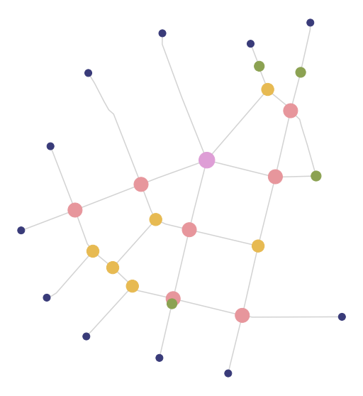

# Converting from geodataframe to graph and back

The model situation expects to have all input data for analysis in `GeoDataFrames`, including street network (e.g. from shapefile).


<div markdown="1" class="cell code_cell">
<div class="input_area" markdown="1">
```python
import momepy
import geopandas as gpd
import matplotlib.pyplot as plt
import networkx as nx

```
</div>

</div>


<div markdown="1" class="cell code_cell">
<div class="input_area" markdown="1">
```python
streets = gpd.read_file(momepy.datasets.get_path('bubenec'), layer='streets')

```
</div>

</div>


<div markdown="1" class="cell code_cell">
<div class="input_area hidecode" markdown="1">
```python
f, ax = plt.subplots(figsize=(10, 10))
streets.plot(ax=ax)
ax.set_axis_off()
plt.axis('equal')
plt.show()

```
</div>

<div class="output_wrapper" markdown="1">
<div class="output_subarea" markdown="1">

{:.output_png}


</div>
</div>
</div>


We have to convert this LineString GeoDataFrame to `networkx.Graph`. We use `momepy.gdf_to_nx` and later `momepy.nx_to_gdf` as pair of interconnected functions. `gdf_to_nx` supports both primal and dual graphs. Primal approach will save length of each segment to be used as a weight later, while dual will save the angle between segments (allowing angular centrality).


<div markdown="1" class="cell code_cell">
<div class="input_area" markdown="1">
```python
graph = momepy.gdf_to_nx(streets, approach='primal')

```
</div>

</div>


<div markdown="1" class="cell code_cell">
<div class="input_area hidecode" markdown="1">
```python
nx.draw(graph)

```
</div>

<div class="output_wrapper" markdown="1">
<div class="output_subarea" markdown="1">

{:.output_png}


</div>
</div>
</div>


<div markdown="1" class="cell code_cell">
<div class="input_area" markdown="1">
```python
dual = momepy.gdf_to_nx(streets, approach='dual')
nx.draw(dual)

```
</div>

<div class="output_wrapper" markdown="1">
<div class="output_subarea" markdown="1">

{:.output_png}


</div>
</div>
</div>


At this moment (almost) any `networkx` method can be used. For illustration, we will measure the node degree. Using `networkx`, we can do:


<div markdown="1" class="cell code_cell">
<div class="input_area" markdown="1">
```python
degree = dict(nx.degree(graph))
nx.set_node_attributes(graph, degree, 'degree')

```
</div>

</div>


However, node degree is implemented in momepy so we can use directly:


<div markdown="1" class="cell code_cell">
<div class="input_area" markdown="1">
```python
graph = momepy.node_degree(graph, name='degree')

```
</div>

</div>


Once we have finished our network-based analysis, we want to convert the graph back to geodataframe. For that, we will use `momepy.nx_to_gdf`, which gives us several options what to export.

- `lines`
    - original LineString geodataframe
- `points`
    - point geometry representing street network intersections (nodes of primal graph)
- `spatial_weights`
    - spatial weights for nodes capturing their relationship within a network

Moreover, `edges` will contain `node_start` and `node_end` columns capturing the ID of both nodes at its ends.


<div markdown="1" class="cell code_cell">
<div class="input_area" markdown="1">
```python
nodes, edges, sw = momepy.nx_to_gdf(graph, points=True, lines=True,
                                    spatial_weights=True)

```
</div>

</div>


<div markdown="1" class="cell code_cell">
<div class="input_area hidecode" markdown="1">
```python
f, ax = plt.subplots(figsize=(10, 10))
nodes.plot(ax=ax, column='degree', cmap='tab20b', markersize=(nodes['degree'] * 100))
edges.plot(ax=ax, color='lightgrey')
ax.set_axis_off()
plt.axis('equal')
plt.show()


```
</div>

<div class="output_wrapper" markdown="1">
<div class="output_subarea" markdown="1">

{:.output_png}


</div>
</div>
</div>


<div markdown="1" class="cell code_cell">
<div class="input_area" markdown="1">
```python
nodes.head(3)

```
</div>

<div class="output_wrapper" markdown="1">
<div class="output_subarea" markdown="1">


<div markdown="0" class="output output_html">
<div>
<style scoped>
    .dataframe tbody tr th:only-of-type {
        vertical-align: middle;
    }

    .dataframe tbody tr th {
        vertical-align: top;
    }

    .dataframe thead th {
        text-align: right;
    }
</style>
<table border="1" class="dataframe">
  <thead>
    <tr style="text-align: right;">
      <th></th>
      <th>degree</th>
      <th>nodeID</th>
      <th>geometry</th>
    </tr>
  </thead>
  <tbody>
    <tr>
      <td>0</td>
      <td>3</td>
      <td>1</td>
      <td>POINT (1603585.64021531 6464428.773867372)</td>
    </tr>
    <tr>
      <td>1</td>
      <td>5</td>
      <td>2</td>
      <td>POINT (1603413.20632407 6464228.730248732)</td>
    </tr>
    <tr>
      <td>2</td>
      <td>3</td>
      <td>3</td>
      <td>POINT (1603268.502117987 6464060.781328565)</td>
    </tr>
  </tbody>
</table>
</div>
</div>


</div>
</div>
</div>


<div markdown="1" class="cell code_cell">
<div class="input_area" markdown="1">
```python
edges.head(3)

```
</div>

<div class="output_wrapper" markdown="1">
<div class="output_subarea" markdown="1">


<div markdown="0" class="output output_html">
<div>
<style scoped>
    .dataframe tbody tr th:only-of-type {
        vertical-align: middle;
    }

    .dataframe tbody tr th {
        vertical-align: top;
    }

    .dataframe thead th {
        text-align: right;
    }
</style>
<table border="1" class="dataframe">
  <thead>
    <tr style="text-align: right;">
      <th></th>
      <th>geometry</th>
      <th>mm_len</th>
      <th>node_start</th>
      <th>node_end</th>
    </tr>
  </thead>
  <tbody>
    <tr>
      <td>0</td>
      <td>LINESTRING (1603585.64021531 6464428.773867372...</td>
      <td>264.103950</td>
      <td>1</td>
      <td>2</td>
    </tr>
    <tr>
      <td>1</td>
      <td>LINESTRING (1603561.739920635 6464494.46683961...</td>
      <td>70.020202</td>
      <td>1</td>
      <td>9</td>
    </tr>
    <tr>
      <td>2</td>
      <td>LINESTRING (1603585.64021531 6464428.773867372...</td>
      <td>88.924305</td>
      <td>1</td>
      <td>7</td>
    </tr>
  </tbody>
</table>
</div>
</div>


</div>
</div>
</div>

