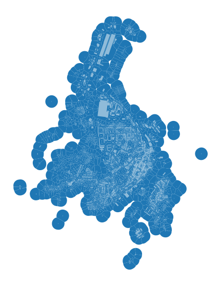
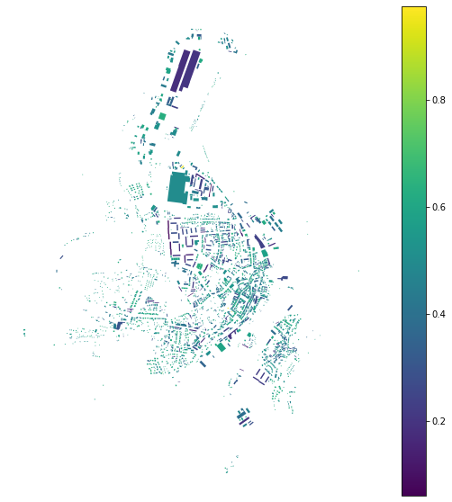
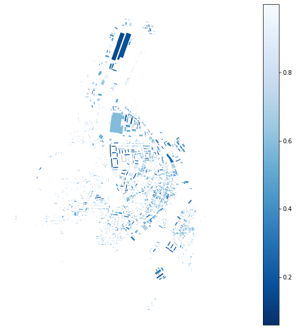
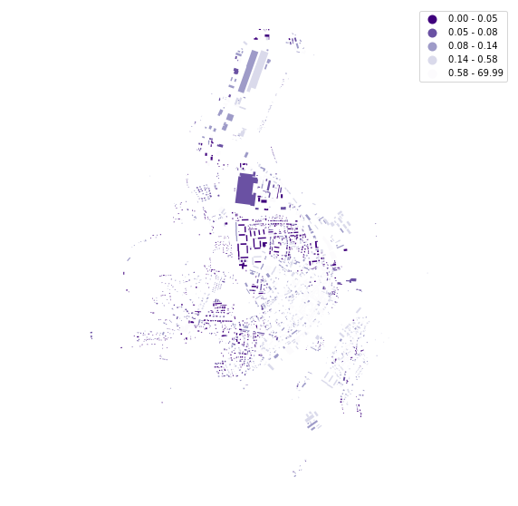
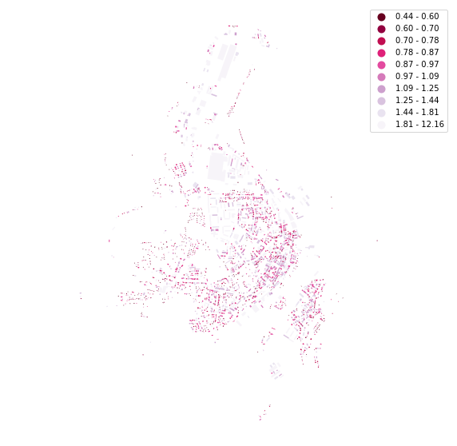
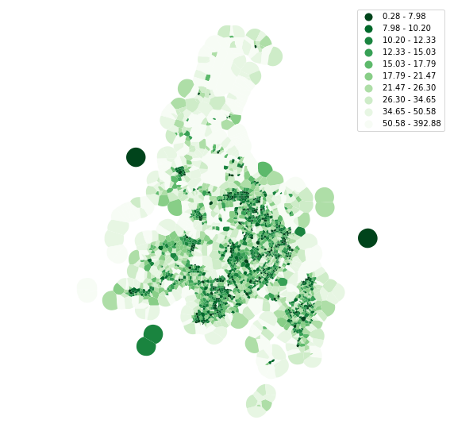
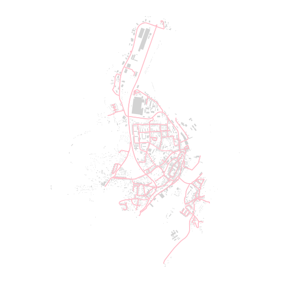
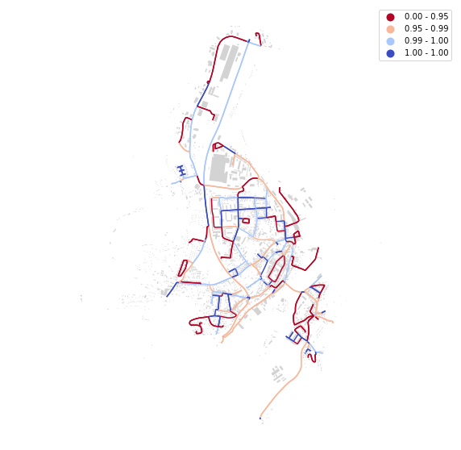

# Simple shape characters

While the majority of `momepy` functions require the interaction of more `GeoDataFrames` or using spatial weights matrix, there are some which are calculated on single `GeoDataFrame` assessing the dimensions or shapes of features. This notebook illustrates how to measure simple shape characters.


<div markdown="1" class="cell code_cell">
<div class="input_area" markdown="1">
```python
import momepy
import geopandas as gpd
import matplotlib.pyplot as plt
import numpy as np

```
</div>

</div>


We will again use `osmnx` to get the data for our example and after preprocessing of building layer will generate tessellation. You can show the code with the button on the right side.


<div markdown="1" class="cell code_cell">
<div class="input_area" markdown="1">
```python
import osmnx as ox

gdf = ox.footprints.footprints_from_place(place='Kahla, Germany')
gdf_projected = ox.project_gdf(gdf)

buildings = momepy.preprocess(gdf_projected, size=30,
                              compactness=True, islands=True)
buildings['uID'] = momepy.unique_id(buildings)
limit = momepy.buffered_limit(buildings)
tess = momepy.Tessellation(buildings, unique_id='uID', limit=limit)
tessellation = tess.tessellation

```
</div>

<div class="output_wrapper" markdown="1">
<div class="output_subarea" markdown="1">
{:.output_stream}
```
Loop 1 out of 2.
Loop 2 out of 2.
Inward offset...
Discretization...
Generating input point array...
Generating Voronoi diagram...
Generating GeoDataFrame...
Dissolving Voronoi polygons...
Preparing limit for edge resolving...
Building R-tree...
Identifying edge cells...
Cutting...
```
</div>
</div>
</div>


<div markdown="1" class="cell code_cell">
<div class="input_area hidecode" markdown="1">
```python
f, ax = plt.subplots(figsize=(10, 10))
tessellation.plot(ax=ax)
buildings.plot(ax=ax, color='white', alpha=.5)
ax.set_axis_off()
plt.axis('equal')
plt.show()

```
</div>

<div class="output_wrapper" markdown="1">
<div class="output_subarea" markdown="1">

{:.output_png}


</div>
</div>
</div>


## Building shapes

Few examples of measuring building shapes. Circular compactness measures the ratio of object area to the area of its smallest circumsribed circle:


<div markdown="1" class="cell code_cell">
<div class="input_area" markdown="1">
```python
blg_cc = momepy.CircularCompactness(buildings)
buildings['circular_com'] = blg_cc.cc

```
</div>

</div>


<div markdown="1" class="cell code_cell">
<div class="input_area hidecode" markdown="1">
```python
f, ax = plt.subplots(figsize=(10, 10))
buildings.plot(ax=ax, column='circular_com', legend=True, cmap='viridis')
ax.set_axis_off()
plt.axis('equal')
plt.show()

```
</div>

<div class="output_wrapper" markdown="1">
<div class="output_subarea" markdown="1">

{:.output_png}


</div>
</div>
</div>


While elongation is seen as elongation of its minimum bounding rectangle:


<div markdown="1" class="cell code_cell">
<div class="input_area" markdown="1">
```python
blg_elongation = momepy.Elongation(buildings)
buildings['elongation'] = blg_elongation.e

```
</div>

</div>


<div markdown="1" class="cell code_cell">
<div class="input_area hidecode" markdown="1">
```python
f, ax = plt.subplots(figsize=(10, 10))
buildings.plot(ax=ax, column='elongation', legend=True, cmap='Blues_r')
ax.set_axis_off()
plt.axis('equal')
plt.show()

```
</div>

<div class="output_wrapper" markdown="1">
<div class="output_subarea" markdown="1">

{:.output_png}


</div>
</div>
</div>


And squareness measures mean deviation of all corners from 90 degrees: 


<div markdown="1" class="cell code_cell">
<div class="input_area" markdown="1">
```python
blg_squareness = momepy.Squareness(buildings)
buildings['squareness'] = blg_squareness.s

```
</div>

</div>


<div markdown="1" class="cell code_cell">
<div class="input_area hidecode" markdown="1">
```python
f, ax = plt.subplots(figsize=(10, 10))
buildings.plot(ax=ax, column='squareness', legend=True, scheme='quantiles', cmap='Purples_r')
ax.set_axis_off()
plt.axis('equal')
plt.show()

```
</div>

<div class="output_wrapper" markdown="1">
<div class="output_subarea" markdown="1">

{:.output_png}


</div>
</div>
</div>


For the form factor, we need to know the volume of each building. While we do not have building height data for Kahla, we will generate them randomly and pass a `Series` containing volume values to `FormFactor`. (Note that for the majority of attributes you can always pass values as the name of the column, `np.array`, or `pd.Series`.)


<div markdown="1" class="cell code_cell">
<div class="input_area" markdown="1">
```python
blg_volume = momepy.Volume(buildings, np.random.randint(4, 20, size=len(buildings)))
buildings['formfactor'] = momepy.FormFactor(buildings, volumes=blg_volume.volume).ff

```
</div>

</div>


<div markdown="1" class="cell code_cell">
<div class="input_area hidecode" markdown="1">
```python
f, ax = plt.subplots(figsize=(10, 10))
buildings.plot(ax=ax, column='formfactor', legend=True, scheme='quantiles', k=10, cmap='PuRd_r')
ax.set_axis_off()
plt.axis('equal')
plt.show()

```
</div>

<div class="output_wrapper" markdown="1">
<div class="output_subarea" markdown="1">

{:.output_png}


</div>
</div>
</div>


## Cell shapes

In theory, you can measure most of the 2D characters on all elements, including tessellation or blocks:


<div markdown="1" class="cell code_cell">
<div class="input_area" markdown="1">
```python
tes_cwa = momepy.CompactnessWeightedAxis(tessellation)
tessellation['cwa'] = tes_cwa.cwa

```
</div>

</div>


<div markdown="1" class="cell code_cell">
<div class="input_area hidecode" markdown="1">
```python
f, ax = plt.subplots(figsize=(10, 10))
tessellation.plot(ax=ax, column='cwa', legend=True, scheme='quantiles', k=10, cmap='Greens_r')
ax.set_axis_off()
plt.axis('equal')
plt.show()

```
</div>

<div class="output_wrapper" markdown="1">
<div class="output_subarea" markdown="1">

{:.output_png}


</div>
</div>
</div>


## Street network shapes

There are some characters which requires street network as an input. We can again use `osmnx` to retrieve it from OSM.


<div markdown="1" class="cell code_cell">
<div class="input_area" markdown="1">
```python
streets_graph = ox.graph_from_place('Kahla, Germany', network_type='drive')
streets_graph = ox.project_graph(streets_graph)

```
</div>

</div>


`osmnx` returns networkx Graph. While momepy works with graph in some cases, for this one we need `GeoDataFrame`. To get it, we can use `ox.save_load.graph_to_gdfs`. (`momepy.nx_to_gdf` might work as well, but OSM network needs to be complete in that case. `osmnx` takes care of it.)


<div markdown="1" class="cell code_cell">
<div class="input_area" markdown="1">
```python
edges = ox.save_load.graph_to_gdfs(streets_graph, nodes=False, edges=True,
                                   node_geometry=False, fill_edge_geometry=True)

```
</div>

</div>


<div markdown="1" class="cell code_cell">
<div class="input_area hidecode" markdown="1">
```python
f, ax = plt.subplots(figsize=(10, 10))
edges.plot(ax=ax, color='pink')
buildings.plot(ax=ax, color='lightgrey')
ax.set_axis_off()
plt.axis('equal')
plt.show()

```
</div>

<div class="output_wrapper" markdown="1">
<div class="output_subarea" markdown="1">

{:.output_png}


</div>
</div>
</div>


Now we can calculate linearity of each segment:


<div markdown="1" class="cell code_cell">
<div class="input_area" markdown="1">
```python
edg_lin = momepy.Linearity(edges)
edges['linearity'] = edg_lin.linearity

```
</div>

</div>


<div markdown="1" class="cell code_cell">
<div class="input_area hidecode" markdown="1">
```python
f, ax = plt.subplots(figsize=(10, 10))
edges.plot(ax=ax, column='linearity', legend=True, cmap='coolwarm_r', scheme='quantiles')
buildings.plot(ax=ax, color='lightgrey')
ax.set_axis_off()
plt.axis('equal')
plt.show()

```
</div>

<div class="output_wrapper" markdown="1">
<div class="output_subarea" markdown="1">

{:.output_png}


</div>
</div>
</div>

