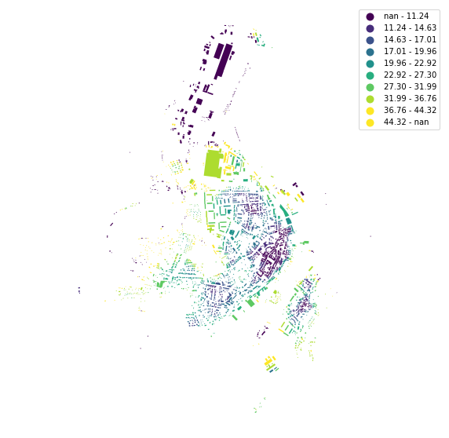

# Using two spatial weights matrices

Some functions are using spatial weights for two different purposes. Therefore two matrices have to be passed. We will illustrate this case measuring building adjacency and mean interbuilding distance. 


<div markdown="1" class="cell code_cell">
<div class="input_area" markdown="1">
```python
import momepy
import geopandas as gpd
import matplotlib.pyplot as plt

```
</div>

</div>


We will again use `osmnx` to get the data for our example and after preprocessing of building layer will generate tessellation. 


<div markdown="1" class="cell code_cell">
<div class="input_area" markdown="1">
```python
import osmnx as ox

gdf = ox.footprints.footprints_from_place(place='Kahla, Germany')
gdf_projected = ox.project_gdf(gdf)

buildings = momepy.preprocess(gdf_projected, size=30,
                              compactness=True, islands=True)
buildings['uID'] = momepy.unique_id(buildings)
limit = momepy.buffered_limit(buildings)
tessellation = momepy.Tessellation(buildings, unique_id='uID', limit=limit).tessellation

```
</div>

<div class="output_wrapper" markdown="1">
<div class="output_subarea" markdown="1">
{:.output_stream}
```
Loop 1 out of 2.
Loop 2 out of 2.
Inward offset...
Discretization...
Generating input point array...
Generating Voronoi diagram...
Generating GeoDataFrame...
Dissolving Voronoi polygons...
Preparing limit for edge resolving...
Building R-tree...
Identifying edge cells...
Cutting...
```
</div>
</div>
</div>


## Building adjacency

Building adjacency is using `spatial_weights_higher` to denote the area within which the calculation occurs (required) and `spatial_weights` to denote adjacency of buildings (optional, the function can do it for us). We can use distance band of 200 meters to define `spatial_weights_higher`.


<div markdown="1" class="cell code_cell">
<div class="input_area" markdown="1">
```python
import libpysal
dist200 = libpysal.weights.DistanceBand.from_dataframe(buildings, 200,
                                                       ids='uID')

```
</div>

</div>


<div markdown="1" class="cell code_cell">
<div class="input_area" markdown="1">
```python
adjac = momepy.BuildingAdjacency(
    buildings, spatial_weights_higher=dist200, unique_id='uID')
buildings['adjacency'] = adjac.ba

```
</div>

<div class="output_wrapper" markdown="1">
<div class="output_subarea" markdown="1">
{:.output_stream}
```
Calculating spatial weights...
Spatial weights ready...
Calculating adjacency within k steps...
```
</div>
</div>
</div>


<div markdown="1" class="cell code_cell">
<div class="input_area hidecode" markdown="1">
```python
f, ax = plt.subplots(figsize=(10, 10))
buildings.plot(ax=ax, column='adjacency', legend=True, cmap='viridis')
ax.set_axis_off()
plt.axis('equal')
plt.show()

```
</div>

<div class="output_wrapper" markdown="1">
<div class="output_subarea" markdown="1">

{:.output_png}


</div>
</div>
</div>


If we want to specify or reuse `spatail_weights`, we can generate them as Queen contiguity weights. Using `libpysal` or `momepy` (momepy will use the same libpysal method, but you don't need to import libpysal directly):


<div markdown="1" class="cell code_cell">
<div class="input_area" markdown="1">
```python
queen = libpysal.weights.Queen.from_dataframe(buildings,
                                              silence_warnings=True,
                                              ids='uID')
queen = momepy.sw_high(k=1, gdf=buildings, ids='uID', contiguity='queen')

```
</div>

</div>


<div markdown="1" class="cell code_cell">
<div class="input_area" markdown="1">
```python
buildings['adj2'] = momepy.BuildingAdjacency(buildings,
                                             spatial_weights_higher=dist200,
                                             unique_id='uID',
                                             spatial_weights=queen).ba

```
</div>

<div class="output_wrapper" markdown="1">
<div class="output_subarea" markdown="1">
{:.output_stream}
```
Calculating adjacency within k steps...
```
</div>
</div>
</div>


<div markdown="1" class="cell code_cell">
<div class="input_area hidecode" markdown="1">
```python
f, ax = plt.subplots(figsize=(10, 10))
buildings.plot(ax=ax, column='adj2', legend=True, cmap='viridis')
ax.set_axis_off()
plt.axis('equal')
plt.show()

```
</div>

<div class="output_wrapper" markdown="1">
<div class="output_subarea" markdown="1">

{:.output_png}


</div>
</div>
</div>


Both results are the same:


<div markdown="1" class="cell code_cell">
<div class="input_area" markdown="1">
```python
(buildings.adjacency == buildings.adj2).all()

```
</div>

<div class="output_wrapper" markdown="1">
<div class="output_subarea" markdown="1">


{:.output_data_text}
```
True
```


</div>
</div>
</div>


## Mean interbuilding distance

Mean interbuilding distance is similar to `neighbour_distance`, but it is calculated within vicinity defined in `spatial_weights_higher`, while `spatial_weights` captures immediate neighbours.


<div markdown="1" class="cell code_cell">
<div class="input_area" markdown="1">
```python
sw1 = momepy.sw_high(k=1, gdf=tessellation, ids='uID')
sw3 = momepy.sw_high(k=3, gdf=tessellation, ids='uID')

```
</div>

</div>


<div markdown="1" class="cell code_cell">
<div class="input_area" markdown="1">
```python
interblg_distance = momepy.MeanInterbuildingDistance(
    buildings, sw1, 'uID', spatial_weights_higher=sw3)
buildings['mean_ib_dist'] = interblg_distance.mid

```
</div>

<div class="output_wrapper" markdown="1">
<div class="output_subarea" markdown="1">
{:.output_stream}
```
Generating adjacency matrix based on weights matrix...
Computing interbuilding distances...
Computing mean interbuilding distances...
```
</div>
</div>
</div>


`spatial_weights_higher` is optional and can be derived from `spatial_weights` as weights of higher order defined in `order`.


<div markdown="1" class="cell code_cell">
<div class="input_area" markdown="1">
```python
buildings['mean_ib_dist'] = momepy.MeanInterbuildingDistance(
    buildings, sw1, 'uID', order=3).mid

```
</div>

<div class="output_wrapper" markdown="1">
<div class="output_subarea" markdown="1">
{:.output_stream}
```
Generating weights matrix (Queen) of 3 topological steps...
Generating adjacency matrix based on weights matrix...
Computing interbuilding distances...
Computing mean interbuilding distances...
```
</div>
</div>
</div>


<div markdown="1" class="cell code_cell">
<div class="input_area hidecode" markdown="1">
```python
f, ax = plt.subplots(figsize=(10, 10))
buildings.plot(ax=ax, column='mean_ib_dist', scheme='quantiles', k=10, legend=True, cmap='viridis')
ax.set_axis_off()
plt.axis('equal')
plt.show()

```
</div>

<div class="output_wrapper" markdown="1">
<div class="output_subarea" markdown="1">

{:.output_png}


</div>
</div>
</div>

